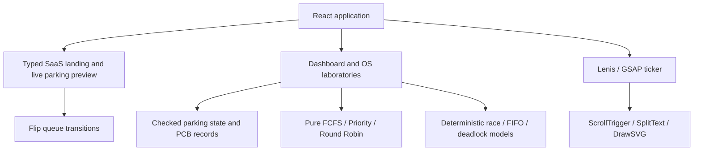

# Architecture

Everything executes locally in the browser. Parking state persists in versioned localStorage. Sandbox scheduling and simulations remain separate from parking state. Logs are bounded. Playback timers are cancelled on unmount.

The latest UI is entirely DOM/SVG: no Three.js, canvas or WebGL requirement. Lenis smooths wheel scrolling, uses native touch behavior, and leaves nested tables/logs alone. One GSAP ticker drives Lenis; it notifies ScrollTrigger. Route changes reset scroll immediately. Reduced-motion users get native scrolling without decorative GSAP animations. GSAP contexts, Flip timelines, Lenis instances, media listeners and ticker callbacks are cleaned up.

See `component-integration.md` for TSX/shadcn structure and `topic-use.md` for the unchanged academic model.
